**Ссылки**
- Гайд по установке clearml: https://clear.ml/docs/latest/docs/getting_started/ds/ds_first_steps
- Гайд по установке сервера clearml на Windows 10: https://clear.ml/docs/latest/docs/deploying_clearml/clearml_server_win/
- Гайд по созданию воркера, обрабатывающего очередь: https://clear.ml/docs/latest/docs/clearml_agent
- Гайд по загрузке данных на сервер: https://clear.ml/docs/latest/docs/clearml_data/clearml_data
- Гайд по деплою: https://clear.ml/docs/latest/docs/clearml_serving/clearml_serving/
- Плейлист с туториалами: https://youtube.com/playlist?list=PLMdIlCuMqSTnoC45ME5_JnsJX0zWqDdlO
- Примеры работы с clearml: https://github.com/allegroai/clearml-serving/tree/main/examples
- Примеры работы с деплойем: https://github.com/allegroai/clearml-serving/tree/main/examples

**Функциональность**
- Запуск эксперимента из UI в браузере

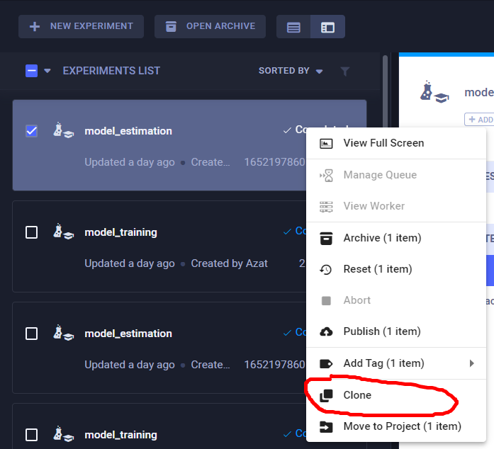
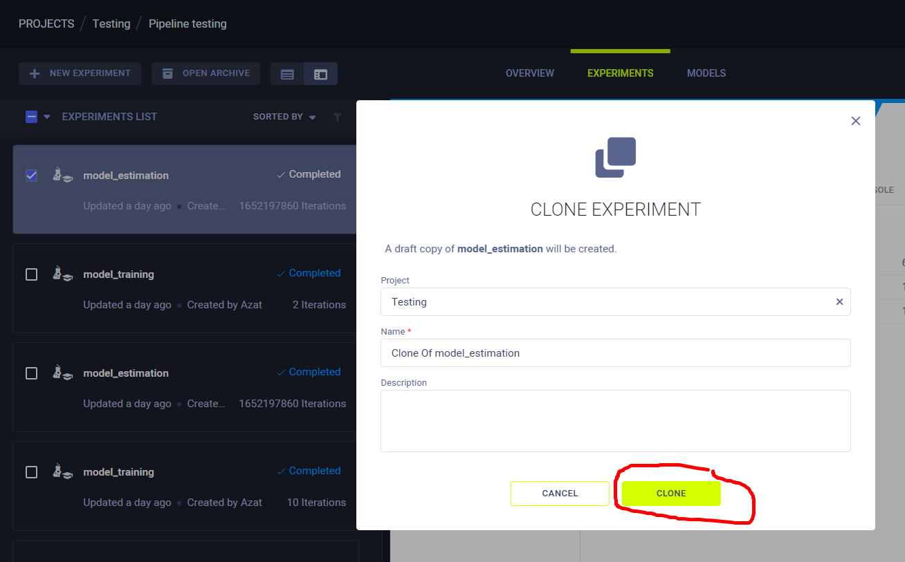
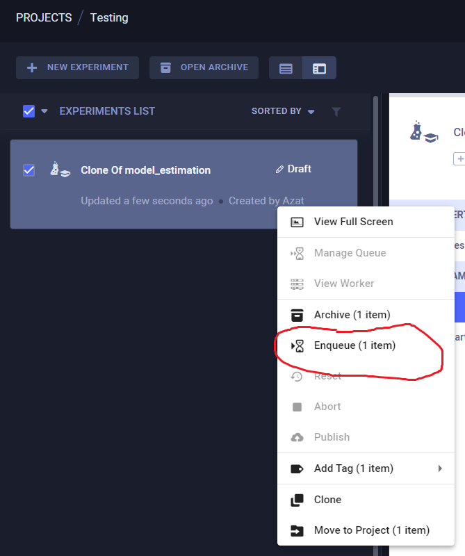
- Изменение параметров эксперимента через UI в браузере
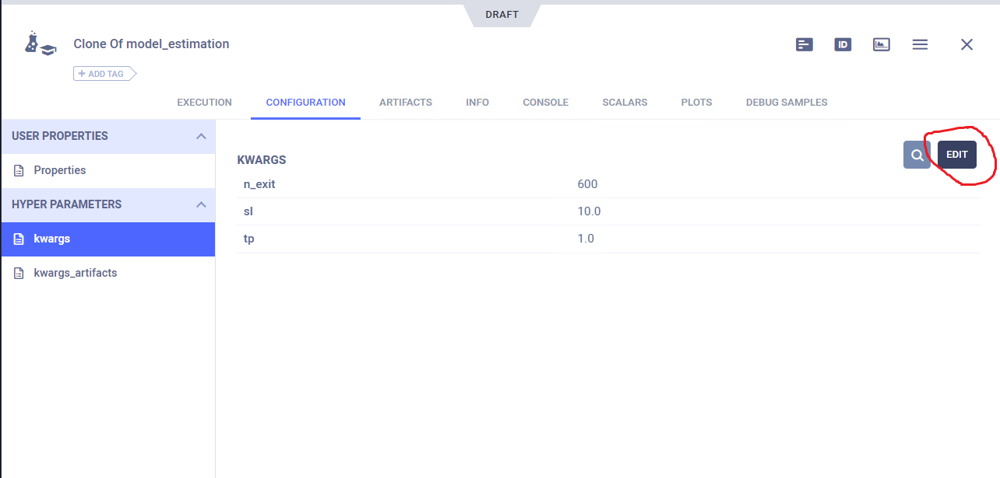
- Версионирование данных (можно так же архитектуры через файлы передавать, поэтому есть полный контроль над версиями данных и архитектурами нейронок), гайд по работе с данными тут: https://www.youtube.com/watch?v=mQtCTnmvf3A&list=PLMdIlCuMqSTnoC45ME5_JnsJX0zWqDdlO&index=9
- Сохранение кода, использованного при запуске
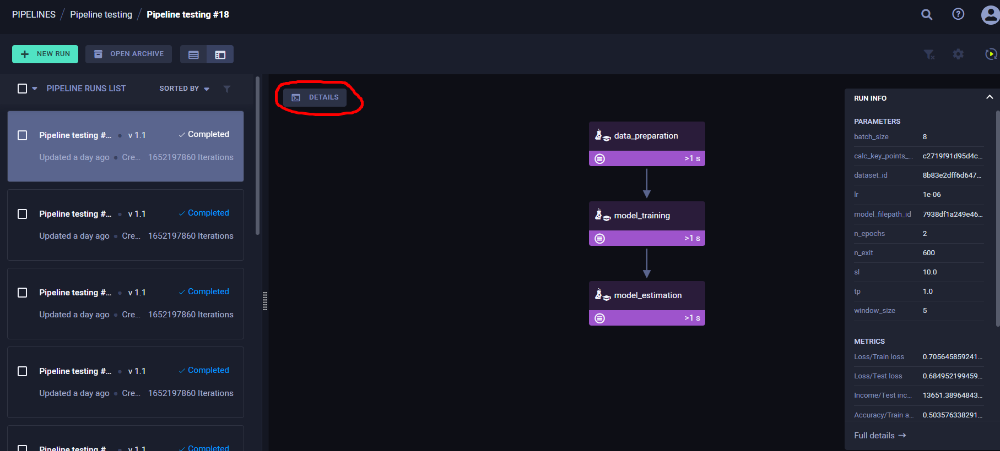
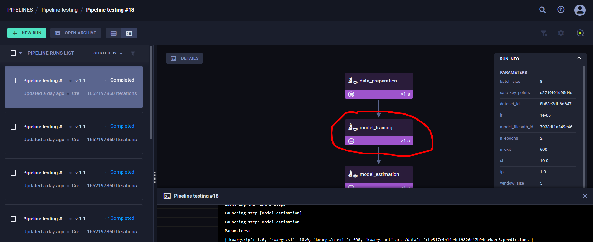
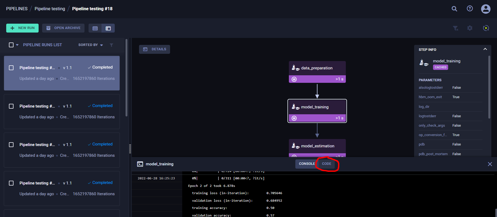
- Разбиение кода на несколько частей и запуск в виде пайплайна
- Кэширование выхода отдельных частей пайплайна (позволяет запускать пайплайн частями при внесении изменений), для этого необходимо выставить параметр cache_executed_step=True при добавлении ступени пайплайна
- Отрисовка графиков в UI в браузере (scalar для графиков через логгер и plots для графиков через mpl)
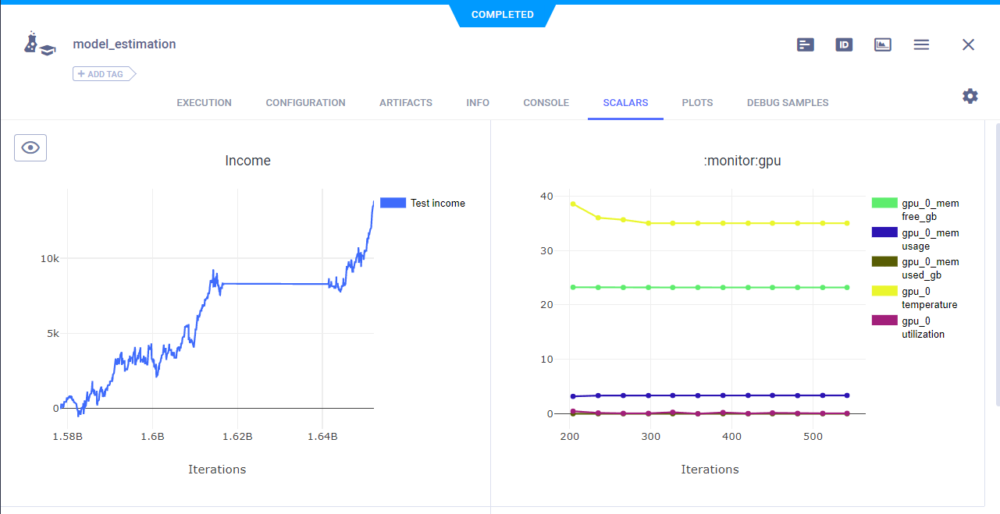
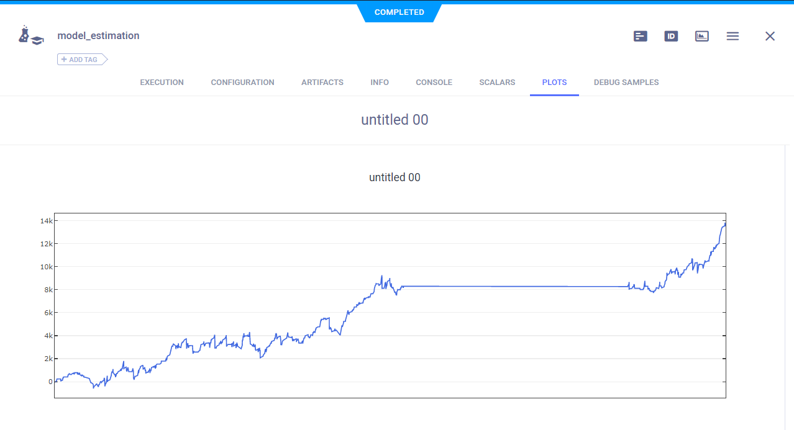
- Просмотр отдельных ступеней пайплайна
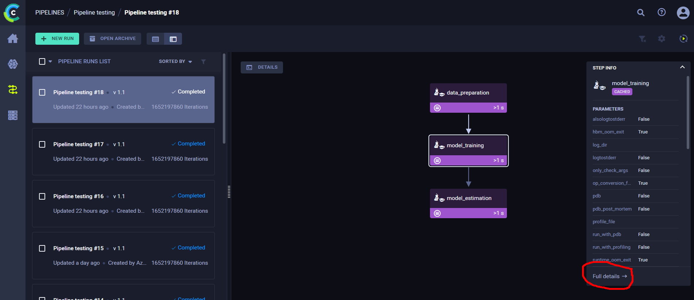
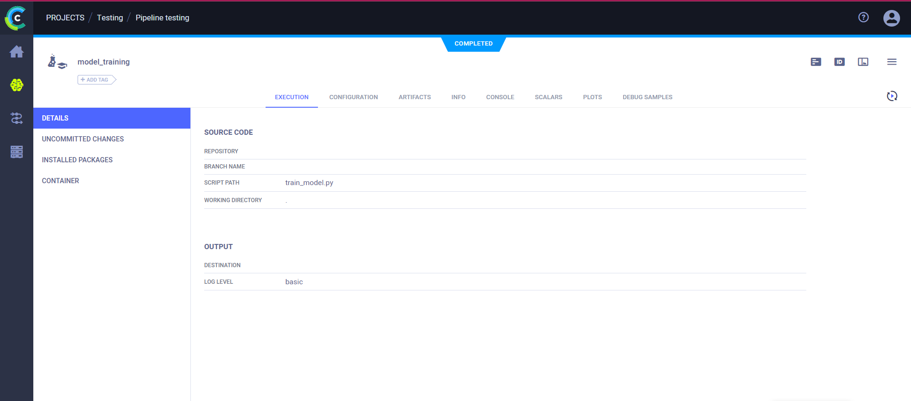
- Просмотр вывода в консоль

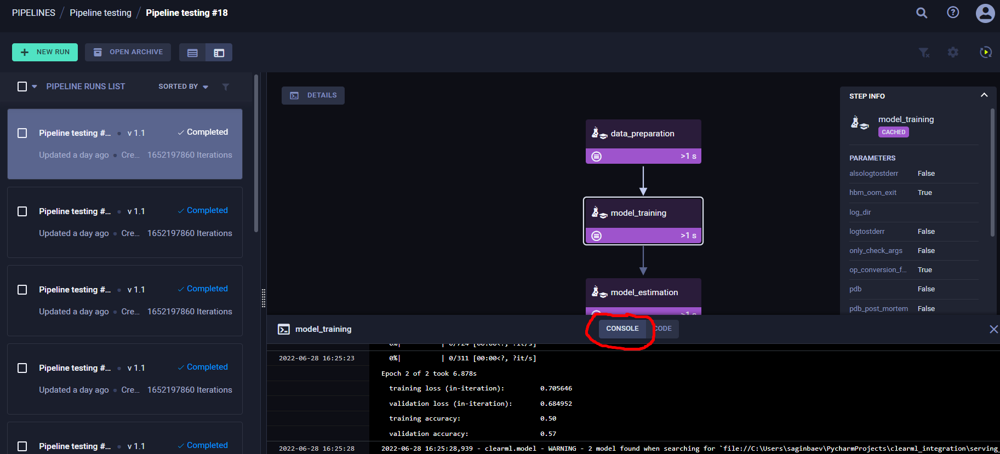
Либо
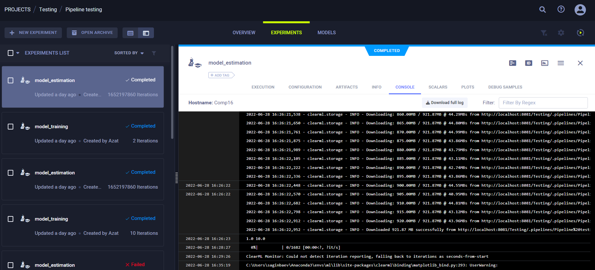
- Выход отдельной ступени
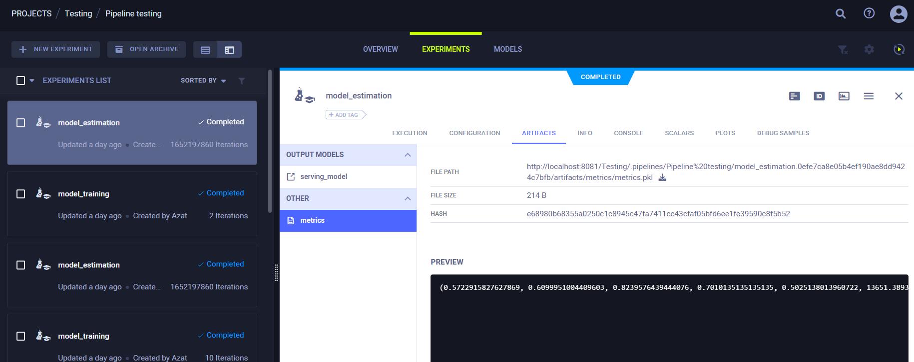
- Сравнение результатов
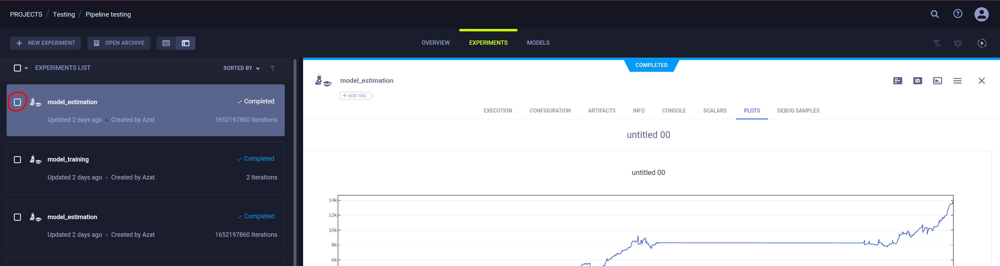
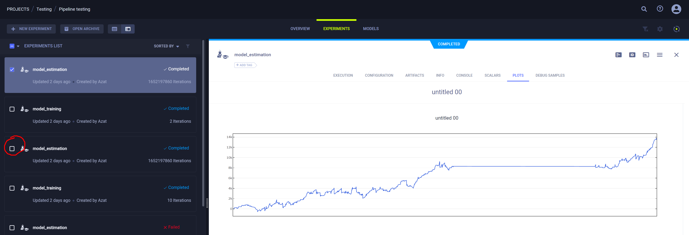
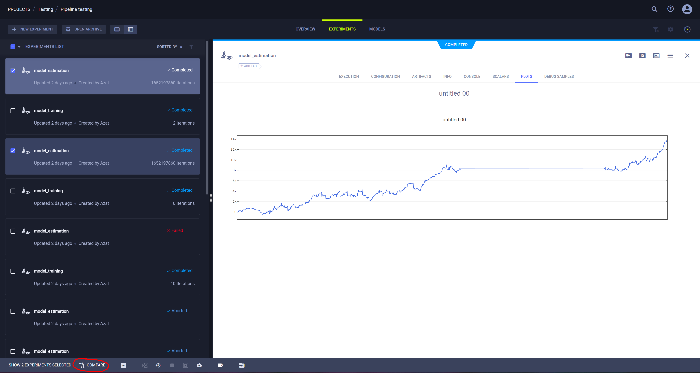
- Hyperparameter sweep
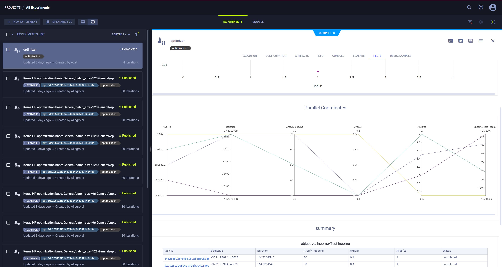
